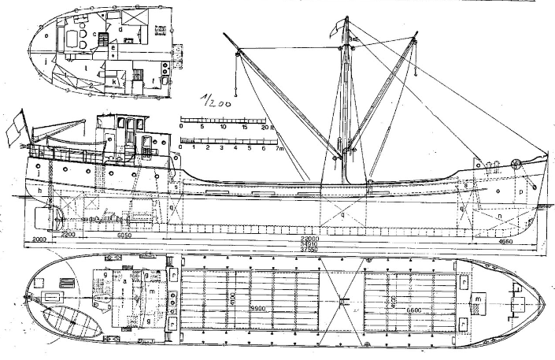

# PavedRoad blueprints

Community developed blueprints for creating any type of application and the tool network to test, deploy, and manage them on any cloud.

- Pure implents common design patterns 
- No-code
- Low-code
- Social

# roadctl

See [roadctl](https://github.com/pavedroad-io/roadctl) the kubectl compatible CLI for compiling and deploying your applications
